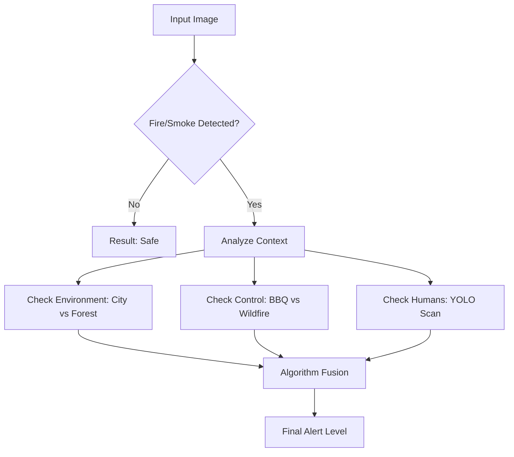

# 🔥 SmartFire AI: Context-Aware Fire Danger Assessment

**SmartFire AI** is an intelligent computer vision system designed to go beyond simple flame detection. Unlike traditional alarms that trigger blindly, this system analyzes the **context** of a fire to determine the actual threat level.

By fusing data from **5 specialized AI models**, the system distinguishes between a dangerous wildfire, a structural fire, and a benign controlled fire (e.g., a barbecue or campfire), while also accounting for environmental factors and human presence.

---

## 🚀 Key Features

1. Multi-Model Fusion Pipeline 

The system does not rely on a single prediction. It aggregates confidence scores from five distinct neural networks:

* **Fire Detection:** Identifies visible flames.
* **Smoke Detection:** Detects early-stage combustion where flames aren't visible.
* **Human Detection:** Uses **YOLOv8** to spot people near the hazard.
* **Environment Classification:** Determines if the scene is **Urban** (City) or **Natural** (Forest).
* **Control Assessment:** Classifies the fire as **Controlled** (e.g., BBQ, Campfire) vs. **Uncontrolled**.

2. Intelligent Danger Scoring 

Based on the fused data, the system calculates a weighted risk score:

* 🟢 **No Danger:** Controlled fire, safe environment.
* 🟠 **Danger:** Uncontrolled fire in a city, or smoke detected.
* 🔴 **Extreme Danger:** Uncontrolled fire in a forest, or humans detected near flames.

3. Robust Edge-Case Handling 

Trained on adversarial datasets including sunsets, reddish fog, and autumn foliage to eliminate common false positives found in standard CV models.

---

## 🏗️ Technical Architecture

The core logic is wrapped in a **Django** web application. The inference pipeline uses a mix of **TensorFlow/Keras** (for classification) and **PyTorch/YOLO** (for object detection).

| Task | Model Architecture | Accuracy |
| --- | --- | --- |
| **Fire / Non-Fire** | MobileNetV2 (Fine-tuned) | <br>**98%** 

 |
| **Smoke / Non-Smoke** | EfficientNetB0 | <br>**98%** 

 |
| **Environment (City/Forest)** | MobileNetV2 | <br>**96%** 

 |
| **Controlled vs. Uncontrolled** | EfficientNetB0 | <br>**96%** 

 |
| **Human Detection** | YOLOv8 | N/A |

### Decision Logic Flow



---

## 📂 Project Structure

```text
.
├── core/                  # Main Application Logic
│   ├── model.py           # Deep Learning model loaders (TF/Keras)
│   ├── predictors.py      # Inference logic & Fusion algorithm
│   └── views.py           # API endpoints for image upload
├── firedetection/         # Django Project Configuration
├── models/                # Pre-trained weights
│   ├── yolov5su.pt        # YOLO weights
│   └── yolov8n.pt         # YOLO weights
├── templates/             # Frontend UI (HTML)
├── static/                # CSS/JS assets
├── manage.py              # Django entry point
└── requirements.txt       # Dependencies

```

---

## 🧠 Engineering Challenges & Solutions

1. The "Sunset" Paradox 

**Problem:** Early iterations of the MobileNet model classified sunsets and red clouds as massive fires due to color histogram similarities.
**Solution:** We curated a custom "Adversarial Dataset" containing high-frequency edge cases (sunsets, red fog, neon lights) and retrained the classification head to learn texture features rather than just color.

2. Lack of "Controlled Fire" Data 

**Problem:** No public datasets exist that label "Safe Fires" (BBQs) vs "Dangerous Fires".
**Solution:**

* **Scraping:** Automated collection via Pexels/Pixabay APIs.
* **GenAI:** Used **Leonardo AI** to generate synthetic training data for specific "safe fire" scenarios.
* **Manual Filtering:** rigorously cleaned data to prevent noise.

---

## 💻 Installation & Usage

### Prerequisites

* Python 3.8+
* Virtualenv (recommended)

### Steps

1. **Clone the repository**
```bash
git clone https://github.com/yourusername/smartfire-ai.git
cd smartfire-ai

```


2. **Install dependencies**
```bash
pip install -r requirements.txt

```


3. **Apply Migrations**
```bash
python manage.py migrate

```


4. **Run the Server**
```bash
python manage.py runserver

```


Access the web interface at `http://127.0.0.1:8000`.

